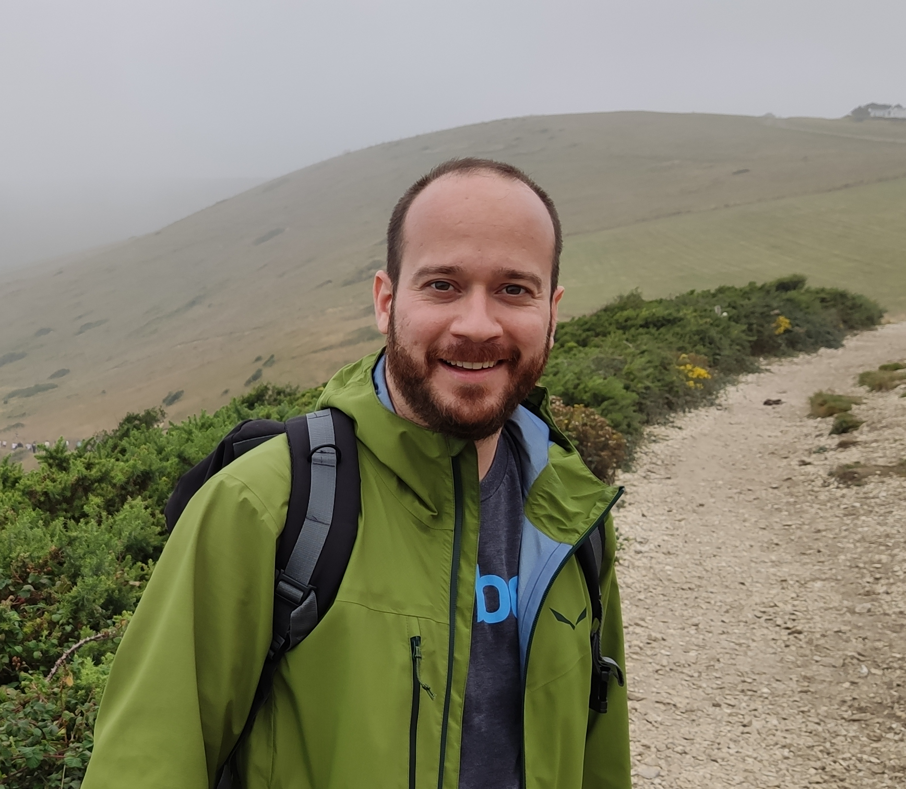

# Organizers

<table cellspacing="0" cellpadding="0" style="border-collapse: collapse; margin: 2cm;">
    <tr>
        <td style="text-align: center; border: none;"><figure><figcaption>
        <a href="https://scholar.google.com/citations?user=Xmlr1xQAAAAJ&hl=en&inst=15262737669262836719&oi=ao">Xilu Wang</a>,   University of Surrey</figcaption></figure></td>
        <td style="text-align: center; border: none;"><figure><figcaption>
        <a href="https://scholar.google.com/citations?user=Xmlr1xQAAAAJ&hl=en&inst=15262737669262836719&oi=ao">Pedro Porto Buarque de Gusmão</a>,   University of Surrey</figcaption></figure></td>
    </tr> 
    <tr>
        <td style="text-align: center; border: none;"><figure><figcaption>
        <a href="https://scholar.google.com/citations?user=G4Xe1NkAAAAJ&hl=en&oi=ao">Lu Yin</a>,   University of Surrey</figcaption></figure></td>
        <td style="text-align: center; border: none;">
        <figure><figcaption>
        <a href="https://scholar.google.com/citations?user=73IbXtsAAAAJ&hl=en">Wei-Neng Chen</a>,   South China University of Technology</figcaption></figure></td>
     </tr> 
    <tr>
        <td style="text-align: center; border: none;"><figure><figcaption>
        <a href="https://scholar.google.com/citations?user=9vQ7gbgAAAAJ&hl">Yaochu Jin</a>,  Westlack University</figcaption></figure></td>
     </tr> 
</table>
