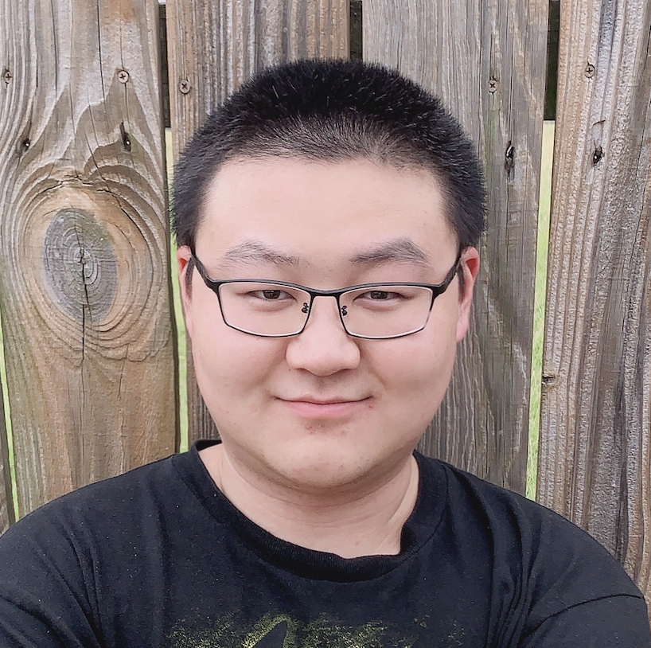

# Invited Speakers

<table cellspacing="0" cellpadding="0" style="border-collapse: collapse; margin: 2cm;">
    <tr>
        <td style="text-align: center; border: none;"><figure><figcaption>
        <a href="https://ai.meta.com/people/807164687865608/yuandong-tian/">Yuandong Tian</a>,   Meta AI</figcaption></figure></td>
        <td style="text-align: center; border: none;"><figure><figcaption>
        <a href="https://tianlong-chen.github.io/">Tianlong Chen</a>,   University of North Carolina  </figcaption></figure></td>
    </tr> 
    <tr>
        <td style="text-align: center; border: none;">
        <figure><figcaption>
        <a href="https://djolonga.com/">Josip Djolonga</a>,  Google Brain</figcaption></figure></td>
        <td style="text-align: center; border: none;"><figure><figcaption>
        <a href="https://www.andrew.cmu.edu/user/beidic/">Beidi Chen</a>,   Carnegie Mellon University</figcaption></figure></td>
    </tr> 
    <tr>
        <td style="text-align: center; border: none;">
        <figure><figcaption>
        <a href="https://jonasgeiping.github.io/">Jonas Geiping</a>,  ELLIS Institute and   Max Planck Institute</figcaption></figure></td>
        <td style="text-align: center; border: none;"><figure><figcaption>
        <a href="https://timdettmers.com/">Tim Dettmers</a>,   Allen Institute for AI and   Carnegie Mellon University</figcaption></figure></td>
     </tr> 
</table>